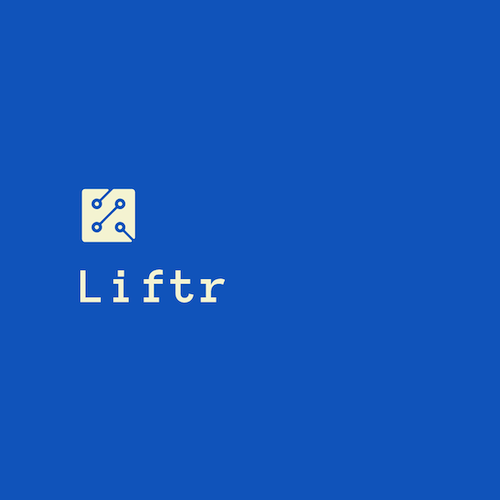

# liftr-cli

<p align="center">
    
</p>

[](https://github.com/liftr-framework/cli)
[](https://github.com/liftr-framework/cli/blob/master/LICENSE/)
[](https://github.com/liftr-framework/cli)

The liftr-cli is a quick project-starter CLI to work with the Liftr framework, it will create the necessary files for you to begin a Node.js & Typescript project. Ontop of that, you can generate new backend components on the fly - providing a quicker way to build structured and robust API's.

## Quickstart

Install the liftr-cli as a global CLI.

```shell
npm install -g @liftr/cli

cd <your-repo-location>

# Then you run
liftr create setup
```

This should setup a project with all the necessary folders and files so that you can begin building straight away!

### Commands

Here are all the possibilities with the liftr-cli

```shell

# Create a setup for your Nodejs/Typescript project
liftr create setup

# THE FOLLOWING COMMANDS CAN ONLY BE DONE IN A LIFTR SETUP
-----------------------------------------------------------
# All files get their own folder in their component folder

# Create a module with its own routes file which provides. The module gets added to the LiftrRoutingModule
liftr create module

# Create a route in a target route file as well as in the target module (should have the same intial name). This will add the route to the routes file and automatically add it to the module.
liftr create route

# Create a controller in the controller folder
liftr create controller

# Create a middleware in the middleware folder
liftr create middleware

```
## Supporting packages

| Package | Description | Version |
| --- | --- | --- |
| [@liftr/core](https://github.com/liftr-framework/core) | The core package for Liftr | [](https://github.com/liftr-framework/core) |
| [@liftr/tscov](https://github.com/jeroenouw/liftr-tscov) | Check the type coverage of your Liftr project TypeScript project | [](https://github.com/jeroenouw/liftr-tscov) |


## Contributing

Want to file a bug, contribute some code, or improve documentation? Feel free to place an [issue](https://github.com/liftr-framework/cli/issues) and check the [contributing guidelines](https://github.com/liftr-framework/cli/blob/master/CONTRIBUTING.md/).
